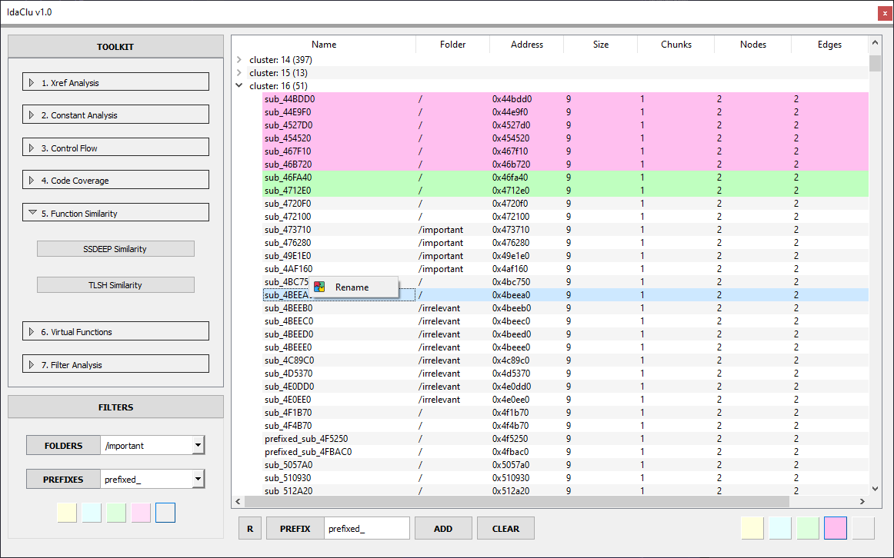
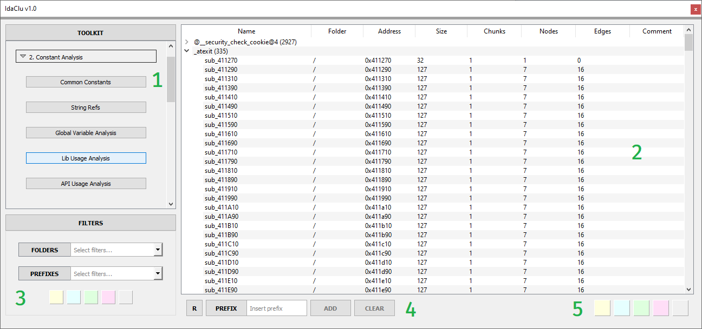
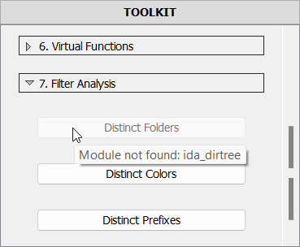

# IdaClu

***IdaClu*** is an ***IDA Pro*** plugin with a straightforward 3-step loop pipeline:

1. Find similarities in functions;
2. Label grouped functions in bulk;
3. Repeat step 1 for labeled functions.

The distinctive feature of the plugin lies in ***"how"*** of search and labeling.

***IdaClu*** won ***1st*** place in [***the Hex-Rays Plugin Contest 2023***](https://hex-rays.com/contests_details/contest2023/) !



## The Purpose

In addition to the plugin ecosystem, the ***IDA*** user community creates a wealth of incredible scripts, varying in complexity. Some could greatly benefit from standardized input/output data format and *GUI*-interface. However, due to time constraints, the relative complexity of learning ***PyQt/PySide***, and the challenge of navigating several backward-incompatible versions of the ***IDAPython API*** many community members are unable to support these efforts. As a result, even the best of us sometimes resort to parsing custom data formats from text files or *output window* of ***IDA***.

***IdaClu*** serves as a ***tree/table view*** for ***IDAPython*** scripts.  
Providing the following features:

- labeling the functions with any combination of *prefix-folder-color*
- filtering the input/output
- using the progress bar indicator
- using the output of other scripts
- providing the output to other scripts

***IDAPython***-scripts serve as *sub-plugins* for ***IdaClu*** if they follow several conventions of how the script should be structured. One core intention is to minimize this impact.

*The plugin* comes with a set of *x18* simplistic and handy scripts available out of the box. They form the basis and make ***IdaClu*** useful as a standalone tool. So support of the community is not a "must".

## Standard Scripts

Scripts are grouped, and while most names are self-explanatory, some may need explanations:

- **Xref Analysis**
  - **Xref Count** - *group by code-xref count*
  - **Xref Source** - *groups: leaf functions, functions with only explicit calls, functions with virtual calls*
  - **Xref Destination** - *groups: independent functions, VFT-functions, library called functions*
- **Constant Analysis**
  - **Common Constants** - *group by constants being referenced*
  - **String Refs** - *group by string refs*
  - **Global Variable Analysis** - *group by refs of defined names*
  - **Lib Usage Analysis** - *group by library function calls*
  - **API Usage Analysis** - *group by API-function calls*
- **Control Flow**
  - **Control Flow Analysis** - *groups: loop-containing funcs, switch-case funcs, recursive funcs*
  - **Pseudocode Size** - *group by pseudocode line count*
- **Code Coverage**
  - **DynamoRIO Functions** - *groups: touched/untouched functions*
- **Function Similarity**
  - **SSDEEP Similarity** - *groups: similar function clusters with **ssdeep***
  - **TLSH Similarity** - *groups: similar function clusters with **tlsh***
- **Virtual Functions**
  - **Explicit Calls** - *group by function call with arguments shown in comments*
  - **Implicit Calls** - *group by VFT-function call with arguments shown in comments*
- **Filter Analysis**
  - **Distinct Folders** - *group by folder path*
  - **Distinct Prefixes** - *group by prefix name*
  - **Distinct Colors** - *group by highlight color*

## User Interface


The user interface intentionally follows [***Miller's Law***](https://en.wikipedia.org/wiki/Miller%27s_law) in *UX* - "The immediate memory span of people is limited to approximately seven items, plus or minus two."  
Here's the breakdown of the main widgets:

1. ***Toolkit*** - scrollable area with buttons for recognized ***IDAPython*** scripts
2. ***View*** - table-based view for script output, function selection, and rendering current labels
3. ***Filters*** - input controls to refine the chosen script's focus
4. ***Labels*** - name of *prefix* or *folder* for selected functions
   - ***R*** - toggle button for recursive mode
   - ***PREFIX*** - interactive label to switch between *FOLDER* and *PREFIX* labeling modes
   - ***ADD*** - button that applies labeling settings
   - ***CLEAR*** - button that clears labeling settings
5. ***Palette*** - a set of 5 mutually exclusive color highlighting buttons

### Tips

1. ***IdaClu*** aims to incorporate new features from new ***IDA***-versions while maintaining *version-agnostic* approach. The solution is *graceful degradation*. So the *UI* will adapt to older ***IDA*** versions, excluding unsupported features.
2. Double-clicking any row in the tree view navigates to the corresponding function in ***IDA***
3. The ***filter*** widget toggles collapse with a header click.
4. The ***toolkit*** widget header click swaps ***tree-view*** and ***sidebar*** with places.
5. ***Rename*** context-menu allows to make custom changes in the selected function name.

## Setup

***IdaClu*** is an ***IDAPython*** plugin without external package dependencies. No building is required. It can be installed by downloading the repository and copying file ***idaclu.py*** and folder ***idaclu*** to your ***IDA Pro*** plugin directory *(either-or)*:

- *C:\Program Files\IDA Pro \<IDA_VERSION\>\plugins*
- *C:\Users\\<USER_NAME\>\AppData\Roaming\Hex-Rays\IDA Pro\plugins*

While the plugin itself doesn't need external packages, some *sub-plugin scripts* might. This won't prevent the plugin from running, but it will gray out the corresponding buttons with an informative tooltip - what's missing.



Follow these instructions if you need these *sub-plugin scripts*:

- ***py-tlsh***

    ```bash
    > pip install py-tlsh
    ```

- ***ssdeep***

    ```bash
    # DO NOT: pip install ssdeep
    > git clone https://github.com/MacDue/ssdeep-windows-32_64
    > cd ssdeep-windows-32_64-master
    > python setup.py install
    ```

- ***yara-python***

    ```bash
    # IDA >v7.x
    > pip install yara-python
    # IDA v6.x
    > pip install yara-python==3.11.0
    ```

### Hint

For continuous updates, clone the repository with ***Git*** and create a ***symlink*** in the ***IDA*** plugin folder:

#### Windows

```sh
:: C:\Users\<username>\AppData\Roaming\Hex-Rays\IDA Pro\plugins\idaclu.py
> mklink "C:\Program Files\IDA Pro X.X\plugins\idaclu.py" <plugin_path>\idaclu.py

:: C:\Users\<username>\AppData\Roaming\Hex-Rays\IDA Pro\plugins\idaclu
> mklink /d "C:\Program Files\IDA Pro X.X\plugins\idaclu" <plugin_path>\idaclu
```

#### Mac

```sh
% ln -s <plugin_path>\idaclu.py /Users/<username>/.idapro/plugins/idaclu.py
% ln -s <plugin_path>\idaclu /Users/<username>/.idapro/plugins/idaclu
```

## Script Ecosystem

The plugin serves as a *GUI* for scripts without one. By following scripting conventions, you can make them compatible with ***IdaClu***. When done correctly, a corresponding button will appear in the ***sidebar***.

### Script Description

The following block is mandatory and is used to register the script in ***IdaClu***:

```python
SCRIPT_NAME = 'Xref Count'  # arbitrary name that will appear on the corresponding button
SCRIPT_TYPE = 'func'  # 'func' or 'custom' depending on whether the script iterates on functions or some other data structures to produce the output
SCRIPT_VIEW = 'tree'  # 'tree' is the only currently supported view, 'table' is to be added
SCRIPT_ARGS = []  # experimental feature, supports tuples of the form ('<control_name>', '<control_type>', '<control_placeholder>')
```

### Main Function

In addition to this, each script must define a single `get_data()` function.  
Currently there are *x2* possible prototypes:

```python
# Case #1: SCRIPT_TYPE == 'func':
def get_data(func_gen=None, env_desc=None, plug_params=None):
    # 1. Iterate over pre-filtered functions via func_gen() generator
    # 2. Progress bar values are calculated automatically
```

```python
# Case #2: SCRIPT_TYPE == 'custom':
def get_data(progress_callback=None, env_desc=None, plug_params=None):
    # 1. Iterate over custom data structures
    # 2. Use `progress_callback(<current_index>, <total_count>)` to report current progress
```

### Execution Environment

If the script logic depends on a specific IDA configuration, the ***IdaClu*** plugin can offer the following properties in the ***env_desc*** object:

```text
- feat_bookmarks
- feat_cpp_oop
- feat_folders
- feat_golang
- feat_ida6
- feat_ioi64
- feat_lumina
- feat_microcode
- feat_microcode_new
- feat_python3
- feat_undo
  ...
```

Before script execution, these fields are guaranteed to be initialized.  
You can refer to the full list in the ***output window*** of ***IDA***. Right under the ***banner*** there will be ***ENVIRONMENT*** section with the dump of current values.

### Custom Input

As an experimental feature, *the plugin* supports custom input for each script.
When defined, the following code will render the input field under the script button upon the first click:

```python
SCRIPT_ARGS = [('file_path', 'file', 'input the file path')]
```

The second click sends this data to the target script, accessible via the ***plug_params*** parameter of the ***get_data()*** function:

```python
plug_params['<control_name>']
```

### Return Value

For hierarchical output data, the script should return ***dictionary of lists***.  
*Keys* of this dictionary are function group names - collapsible elements of *tree view*.  
*Vals* of this dictionary are *either-or*:

- list of function addresses (simple case)
- list of tuples `(<function_address>, <comment>)` (advanced case)

### Remarks

However the rest is up to the author of the certain script,
there are several optional tips:

1. Each script should be assigned to a certain script group. A script group is essentially a folder - ***plugins/idaclu/plugins/\<plugin_group_folder\>/*** containing an ***\_\_init\_\_.py*** file with a single string:

    ```python
    PLUGIN_GROUP_NAME = '<arbitrary_name>'
    ```

2. For ***IDAPython*** cross-compatibility consider using bundled shims module:

    ```python
    from idaclu import ida_shims
    ```

3. If the script utilizes ***func-generator*** consider employing the following code for debugging and running the script even outside the ***IdaClu*** environment:

    ```python
    def debug():
        data_obj = get_data(func_gen=idautils.Functions)
        ida_shims.msg(json.dumps(data_obj, indent=4))

    if __name__ == '__main__':
        debug()
    ```

In case anything is left uncovered in this ***README***, refer to example scripts or contact the ***IdaClu*** author.

## Compatibility

**Recommended specs:** *IDA Pro v8.2+* with *Python v3.x*.  
**Minimum specs:** *IDA Pro v6.7+* with *Python v2.7+*.  

**Test environment:**

  1. *IDA Pro v6.7 + Windows 7*
  2. *IDA Pro v7.7 + Windows 10*
  3. *IDA Pro v8.2 + Windows 11*
  4. *IDA Pro v7.0, MacOS High Sierra v10.13.6*
  5. *IDA Pro v7.6, MacOS Ventura v13.2.1*

Other ***IDA*** versions can be added as test environments upon request.  
To be cross-compatible ***IdaClu*** relies on ***PyQt*** and ***IdaPython*** shims.  
Scripts bundled with ***IdaClu*** currently are ***PE-first*** and ***Intel x86/x64-first*** due to the author's work specifics.

## Upcoming Changes

- table view for the scripts that output non-hierarchical data
- several types of controls to provide input to scripts
- lots of code optimizations
- sort data in columns by clicking the column headers for tree/table view
- a more flexible API for the scripts
- more detailed IDA environment detection
- helper context menus for native IDA widgets
- filter refresh if changes to .idb were made outside the plugin
- grayed out narrow folder filters if they are subsumed by broader ones
- "save to file" option for the current view
- time estimation for large binaries
- caption of the processing phase in *UI*
- breakpoint setting feature
- count of functions currently selected
- folder labels with hierarchy
- button to clear all labels at once

Feel free to come up with your ideas/proposals.  
They will be carefully considered and their implementation is highly likely to be included in upcoming plugin releases.

## Known bugs

- Minor issues with cross-compatibility
- Comment column remains unhidden with empty comments
- Some bundled plugins produce quite dirty output:
  - *Global Variable Analysis*
- Some scripts and their corresponding groups do not match
- Experimental "Code Coverage" plugin fails to load
- Explicit folder filtering with `"/"` as a parameter does not work as expected
- Labels are still present in filters after being removed from .idb
- In recursive mode, the function can be prefixed multiple times
- Recursive mode is not considered while highlighting with color

## Acknowledgements

- [***Caroline 'By0ute' Beyne***](https://github.com/By0ute) for the simplistic [***PoC of collapsible PyQt widget***](https://github.com/By0ute/pyqt-collapsible-widget)
- [***Markus 'gaasedelen' Gaasedelen***](https://github.com/gaasedelen) for [***DrCov file format parser***](https://github.com/gaasedelen/lighthouse/blob/develop/plugins/lighthouse/reader/parsers/drcov.py)
- [***Willi Ballenthin***](https://gist.github.com/williballenthin) of *Mandiant* for [***PoC of PyQt-shim script***](https://gist.github.com/williballenthin/277eedca569043ef0984) to support both ***PySide (IDA <v6.9)*** and ***PyQt (IDA >=v6.9)***
- Guys from [***Gray Hat Academy***](https://github.com/grayhatacademy) for [***PoC of IDAPython-shim script***](https://github.com/grayhatacademy/ida/blob/master/plugins/shims/ida_shims.py) to support ***v6.x-v7.x*** versions of ***IDAPython API***
- [***mr.d0x***](https://github.com/mrd0x) for the original idea of ***Windows API*** classification demonstrated on [***MalAPI.io***](https://malapi.io/)

## Version History

- ***2023-12-1x*** - Obfuscation detection sub-plugins *(UPCOMING)*
- ***2023-12-01*** - Release of more stable *v1.0*
- ***2023-09-14*** - The original release of ***IdaClu*** *v0.9*!